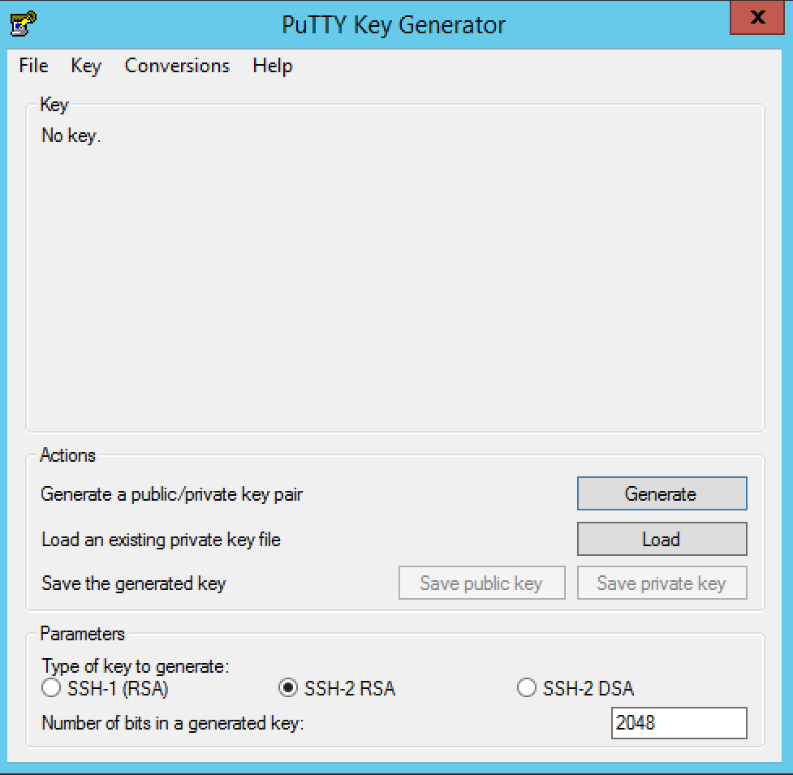
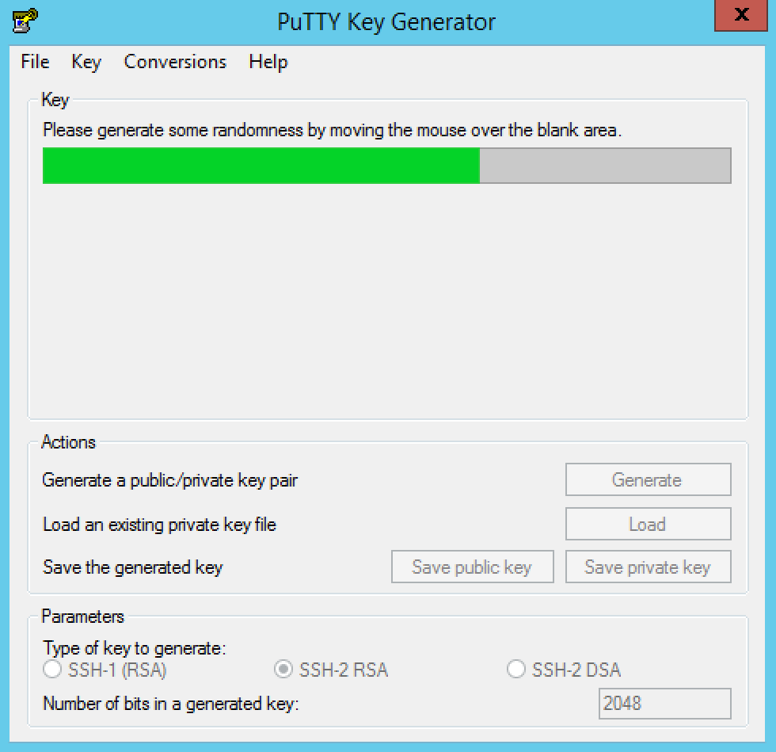
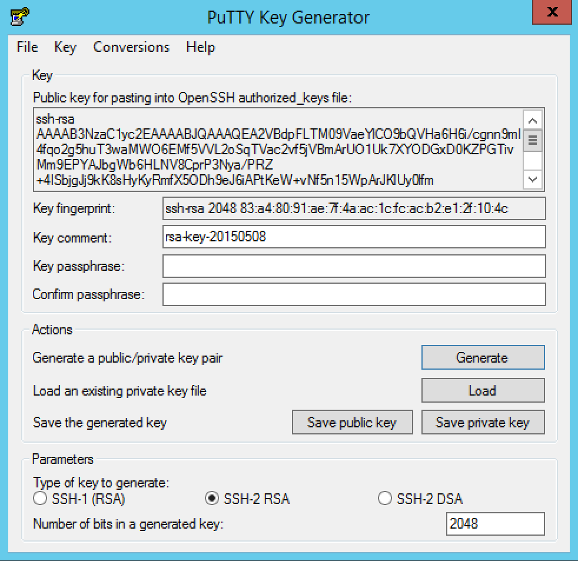
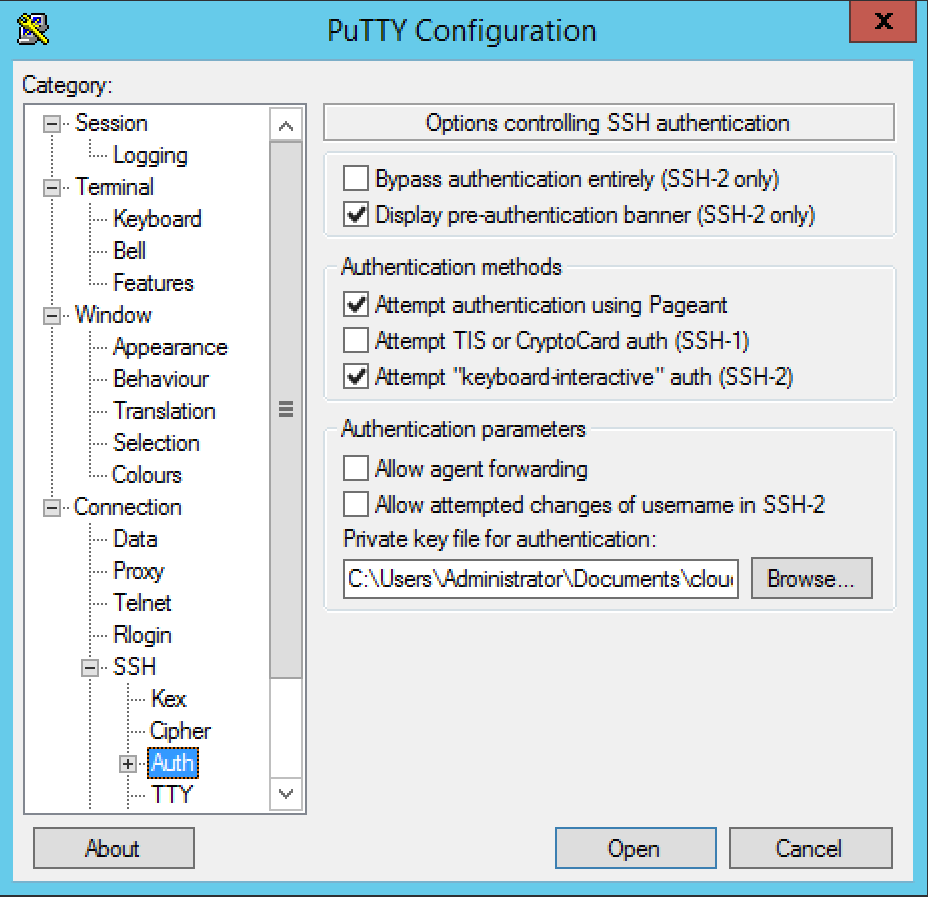

If the deployment of an application works correctly, then you can just
use the public interfaces for the service (e.g. a web browser
interface) without having to directly access the deployed virtual
machines.  Unfortunately, especially when developing new application
deployments, failures do happen.  In these cases **it is extremely
useful to be able to log into a remote virtual machine for
debugging**.

Access via SSH (secure shell) is nearly universally supported for
Unix-like systems.  Although Windows can be configured to support SSH,
this is rarely done.  Instead use of the "Remote Desktop Protocol" is
more typical for Windows machines.

# Secure Shell (SSH) Access

Providing a public SSH (secure shell) key to SlipStream will allow you
to log into the virtual machine instances you create through
SlipStream.  Although this is optional, it is **strongly recommended
that you provide such a key**.  It makes debugging cloud and
application failures much easier.

To use SSH you must have:

  - A valid SSH key pair (public and private key) and
  - An SSH client installed on your machine (laptop).

The procedure for meeting these requirements depends on the operating
system you're using on your laptop.

# Creating SSH Key Pair

## Linux and Mac OS X

For Linux and Mac OS X machines (and in general Unix-like
environments), all of the software to run an SSH client and to
generate an SSH key pair is normally pre-installed.

From the command line on your machine, you can generate a new key pair
with the following command:

    $ ssh-keygen

This will then prompt for information.  The default location is
usually fine.  You can use a private key with a password, but this
often requires typing the password repeatedly.  It is often more
convenient to create the **SSH private key without a password**;
provide nothing for the password value when prompted to do this.

The public key you will need to give to SlipStream will then usually
be in the file `~/.ssh/id_rsa.pub`.  (The exact path will be indicated
in the prompts from the `ssh-keygen` command.)  See below for how to
configure your user profile with this information.

## Windows

The standard SSH client to use on Windows is [PuTTY][putty].  You will
need both the `putty.exe` and `puttygen.exe` executables.  Download
these executables and put them in a convenient location.

### Key Pair

The SSH protocol requires a pair of cryptographic keys; one private
and the other public.  You will need to generate a key pair to use
with SlipStream and the underlying cloud infrastructures. 

Launch PuTTyGen.  You should see a screenshot like the following.

Launch PuTTyGen and then click on the "Generate" button.  Move your
mouse around in the empty rectangle to generate some randomness for
the key generation process.

When the process is finished.  You will see a window like the
following.

The value you want to copy and paste into the SlipStream SSH key
configuration is given in the box entitled "Public key for pasting
into OpenSSH authorized_keys file".  Ensure that you copy the **entire
value** and that the pasted value is **entirely on one line**. 

You must save the public and private keys to use when you want to
connect to a virtual machine.  Click on the "Save public key" and
"Save private key" buttons to do so.  You can answer "Yes" when asked
whether to save the private key without a password. 

### Using the Key Pair

To access a remote machine running the SSH daemon, you will need to
use the key pair that you've generated.  Start `putty.exe` and then
navigate in the tree on the left to "SSH -> Auth".  You can then add
the private key to use by clicking on the "Browse" button and
selecting the private key that you saved earlier. 

You may want to download and configure `paegent.exe` with your private
key to avoid having to specify the private key for each session.  See
the PuTTy documentation for how to do this.

# Adding SSH Key to User Profile

To allow SlipStream to configure your virtual machines for remote
access, you must provide your SSH public key in your user profile:

  1. Open your user profile and click on the "Edit" button.
  2. Open the "General" section by clicking on the section header. 
  3. In the "SSH Public Key(s)" field, provide the contents of your
     SSH public key file (usually `~/.ssh/id_rsa.pub`).
  4. Save your profile. 

Changes to your SSH key will only affect virtual machines started
after the change has been saved; it will not affect virtual machines
that are already running. 

> Your SSH public key must be on a single line in the OpenSSH format.
> If you have more than one key, then each must appear on a separate
> line.
{: .warning}

# Remote Desktop Protocol

Windows machines rarely support SSH for remote access.  Instead
Windows uses its own protocol (Remote Desktop Protocol) to provide
remote graphical access to a Windows machine.  You must have a "Remote
Desktop Connection" client installed on your laptop to access Windows
machines. 

## Mac OS X

The "Remote Desktop Connection" application by Microsoft is available
in the Mac App Store.  Simply search for the application in the App
Store and install it.

## Linux

Several "Remote Desktop Protocol" clients exist for Linux operating
systems.  Use the package installer of your operating system to search
and to install one of these clients.

## Windows

The "Remote Desktop Connection" functionality is integrated into all
recent (and not so recent) releases of Windows.  The client should
already be available on your machine. 

# VNC (Virtual Network Computing)

The VNC software allows the graphical console of a Linux machine to be
used across the network from another machine; this is essentially the
equivalent to the "Remote Desktop Protocol" for Windows.

**If the VNC software has been installed and configured on the virtual
machine, a VNC client can be used to connect to it.** A client can be
easily downloaded and installed for all operating systems.  Use your
package manager (or Google) to find and to install a VNC client.

> Many machines do not have VNC installed.  Before trying to connect
> with a VNC client, verify that the machine supports VNC and that the
> necessary ports (5900-5902) are open in the cloud's firewall.
{: .important}

# Exercises

  1. Ensure you have an SSH client installed on your machine
  2. Ensure you have an SSH key pair, generating one if necessary
  3. Configure your user profile with your SSH public key

[putty]: http://www.chiark.greenend.org.uk/~sgtatham/putty/
[so-ssh]: http://stackoverflow.com/questions/2224066/how-to-convert-ssh-keypairs-generated-using-puttygenwindows-into-key-pairs-use
[aws-ssh]: http://docs.aws.amazon.com/AWSEC2/latest/UserGuide/putty.html
